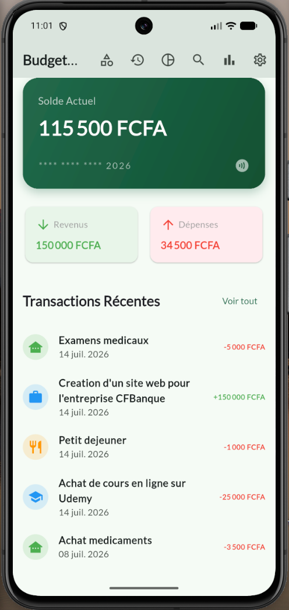
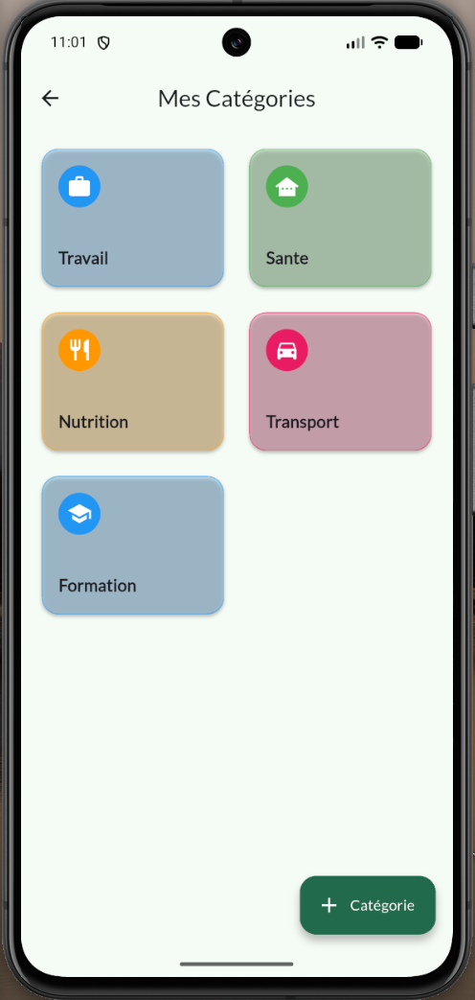
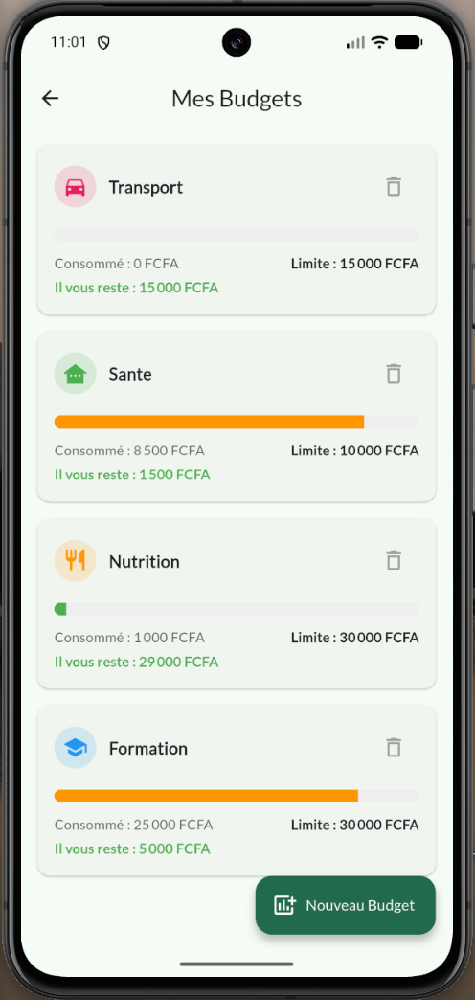
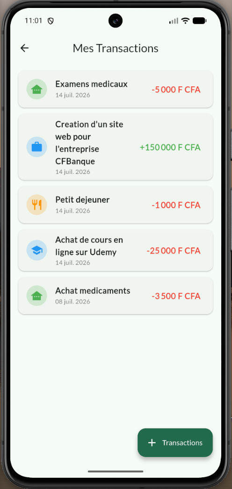
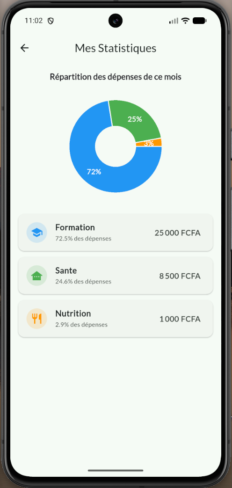
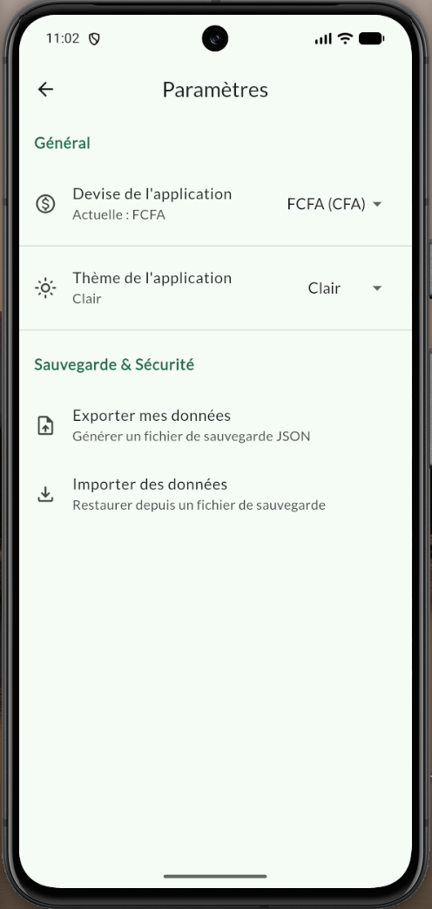
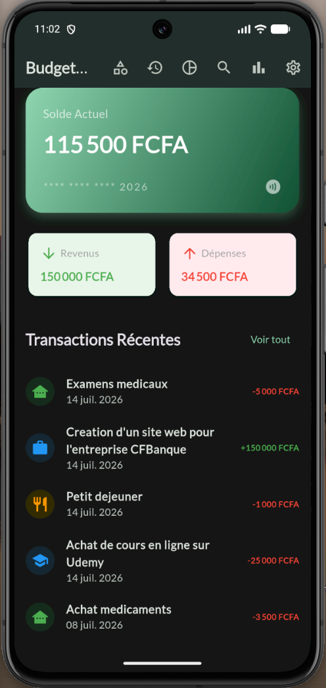
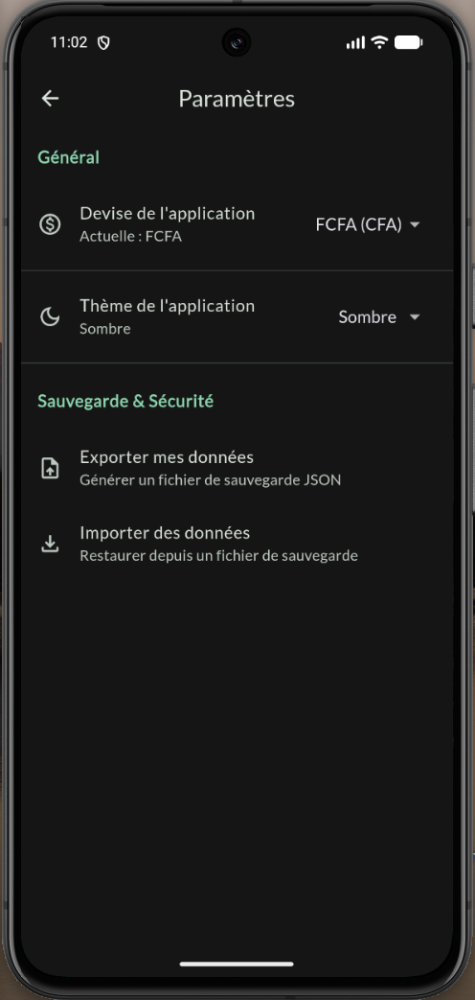

<div style="text-align: center;">

# 💸 BudgetFlow

**BudgetFlow** est une application mobile moderne de gestion de finances personnelles et de suivi budgétaire. Conçue avec **Flutter** et **Dart**, elle applique les principes de la Clean Architecture pour offrir une expérience hors-ligne ultra-rapide, sécurisée et entièrement réactive.

---
</div>

## ✨ Fonctionnalités Clés

- **Tableau de Bord Réactif :** Visualisation immédiate du solde global, des revenus et des dépenses du mois courant avec une interface soignée.
- **Gestion des Catégories & Transactions (CRUD) :** Enregistrement complet (type, montant, commentaires, icônes et couleurs) et suppression moderne par glissement (_Swipe-to-delete_).
- **Sécurité Biométrique (Niveau Bancaire) 🔒 :** Verrouillage de l'application dès le démarrage via **FaceID / TouchID / Empreinte digitale** pour protéger vos données financières sensibles.
- **Budgets Mensuels & Seuils d'Alerte :** Définition de plafonds de dépenses par catégorie avec jauges de progression dynamiques (Vert 🟢 ➔ Orange 🟡 ➔ Rouge 🔴).
- **Notifications Locales (Pushs) 🚨 :** Alertes système envoyées en tâche de fond dès qu'un budget franchit le seuil critique de 80% ou de 100%.
- **Recherche & Filtres Avancés :** Moteur de recherche textuel et filtres combinés en temps réel (In-Memory Filtering) pour une réactivité instantanée.
- **Statistiques & Graphiques 📊 :** Analyse visuelle de la répartition des dépenses via des graphiques circulaires (_Pie Charts_) interactifs.
- **Paramètres & Portabilité :** Choix dynamique de la devise ($ , € , FCFA) et système d'import/export complet de la base de données au format JSON.

---

## 🏗️ Architecture Technique & Stack

L'application est structurée selon une architecture modulaire propre (_Clean Architecture_ simplifiée), garantissant un code découplé, testable et facilement maintenable :

- **UI / Framework :** Flutter (Material 3, animations de transition personnalisées via GoRouter, mode sombre natif).
- **Gestion d'État :** [Riverpod](https://riverpod.dev/) (Notifier, AsyncNotifier) pour un flux de données unidirectionnel, robuste et sans faille.
- **Base de Données Locale :** [Drift (ex-Moor)](https://drift.simonbinder.eu/) — Moteur SQLite réactif écrit en Dart, avec gestion automatisée des migrations de schémas.
- **Sécurité :** [local_auth](https://pub.dev/packages/local_auth) pour l'intégration de l'authentification biométrique matérielle (Android/iOS).
- **Graphiques :** [fl_chart](https://pub.dev/packages/fl_chart) pour des visualisations hautement personnalisables.
- **Notifications :** [flutter_local_notifications](https://pub.dev/packages/flutter_local_notifications).

```text
lib/
├── core/
│   ├── database/        # Configuration Drift SQLite, DAO & migrations de schémas
│   ├── notifications/   # Initialisation des canaux d'alertes push locales
│   ├── routing/         # Configuration GoRouter & transitions d'écrans animées
│   ├── security/        # Service d'authentification biométrique (FaceID/TouchID)
│   └── theme/           # Charte graphique Material 3 (Clair/Sombre)
└── features/            # Modules découpés par domaine métier (Dashboard, Transactions, Budgets, Search, Stats, Settings, Splash)
    ├── data/            # Récupération des données & Repositories
    ├── domain/          # Modèles de données & Contrats
    └── presentation/    # Widgets UI & Contrôleurs (Riverpod Notifiers)
```

---

## 🛠️ Installation & Lancement

**1. Prérequis environnementaux :**

- Configuration Android (android/app/src/main/AndroidManifest.xml)

Assurez-vous que la permission biométrique est bien présente :

```bash
<uses-permission android:name="android.permission.USE_BIOMETRIC"/>
```

Note : Votre MainActivity doit hériter de FlutterFragmentActivity pour supporter les dialogues biométriques.

- Configuration iOS (ios/Runner/Info.plist)

Ajoutez la clé de description de FaceID :

```bash
<key>NSFaceIDUsageDescription</key>
<string>BudgetFlow nécessite l'accès à FaceID pour sécuriser vos données financières.</string>
```

**2. Commandes de déploiement :**

- **_Cloner le projet :_**

```bash
git clone https://github.com/Delfred237/budget_flow.git
cd budget_flow
```

**_Installer les dépendances :_**

```bash
flutter pub get
```

**_Générer le code de base de données (Drift) :_**

```bash
flutter pub run build_runner build --delete-conflicting-outputs
```

**_Lancer l'application :_**

```bash
flutter run
```

---

## 🔒 Sécurité et Confidentialité

- Zéro Cloud / Zéro Tiers : Aucune donnée financière ne quitte l'appareil. Tout est stocké localement dans une base SQLite isolée.

- Portabilité totale : L'utilisateur reste maître de ses données grâce au système d'import/export JSON brut permettant de migrer son historique sur n'importe quel nouvel appareil en une seconde.

---

# Screenshots

## Home Screen



## Category Screen



## Budget Screen



## Transaction Screen



## Stats Screen



## Settings Screen



## Home Dark Screen



## Settings Dark Screen



---

## Licence

Ce projet est distribué sous licence MIT — voir le fichier `LICENSE` pour le détail. Libre à toi de l'adapter (licence propriétaire, "tous droits réservés") selon l'usage que tu comptes en faire.

---
<div align="center">

Projet développé par **Delfred Fossi**, **developpeur fullstack web et mobile oriente DevOps** dans le cadre d'un apprentissage approfondi de JavaScript et de l'architecture logicielle.

</div>